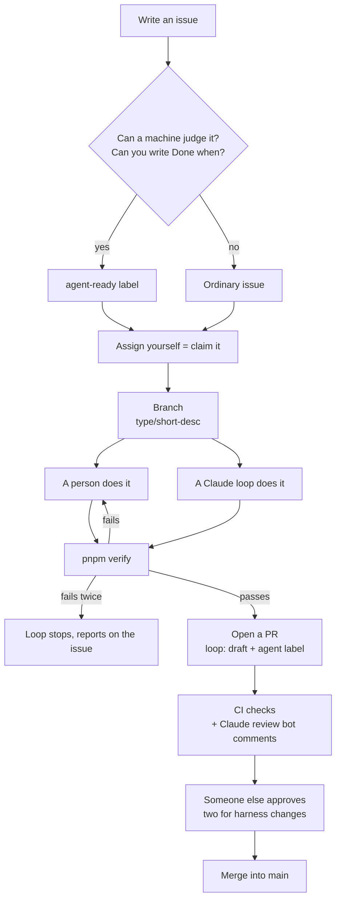

# How this repository works

> A guide for someone joining the project, written so it makes sense without knowing what a
> "harness" or a "loop" is. Korean version: [GUIDE.md](./GUIDE.md) · The rules themselves:
> [CONTRIBUTING.md](../CONTRIBUTING.md), [HARNESS.md](./HARNESS.md)

## 0. In three lines

1. **All work starts as a GitHub issue and ends as a pull request.** You assign yourself to
   the issue, work on a branch, and merge through a pull request.
2. **Code can be written by a person or handed to an AI (Claude).** Either way it passes
   the same checks, and the final approval always comes from someone else.
3. **There are four layers of checks.** Claude's settings on your machine → `pnpm verify` →
   GitHub CI → human review. The first three are automatic; only the last is a person.

---

## 1. Five terms are enough

| Term | In plain words | In this repo |
|---|---|---|
| **Harness** | All the rules and guard rails an AI works under. Like a harness on a horse: the AI supplies the force, the harness sets the direction. | `CLAUDE.md`, the `.claude/` folder, the check command, CI. All in the [file map](#5-file-map). |
| **Loop** | Handing the AI a task with "keep fixing and checking until it is done", without a person watching each step. | Claude Code's `/loop` command, used only on issues labelled `agent-ready`. |
| **Oracle** | A test for "done" that a machine can run, instead of a person's eye. | The issue's **Done when** field. E.g. "`e2e/thread.spec.ts` passes". |
| **Hook** | A checkpoint that runs automatically just before Claude executes a command. | `.claude/hooks/`. Blocks committing to main, deploying, force-pushing, printing secrets. |
| **CI** | Checks GitHub runs automatically on every pull request. A failure shows a red mark. | `.github/workflows/`. Types, tests, lint, format, bundle size, hook tests. |

**Why go this far?** Because of something that happened on this project. A change passed
every automated check and still took first-page load from 0.6s to 5.6s. Without a person
looking, it would have shipped. Hence the principle: **hand the AI only work whose "done" a
machine can judge; work that needs judgement stays with a person.**

---

## 2. The path of one piece of work

| Step | What you do | Why |
|---|---|---|
| Issue | Say what changes and why. For AI work use the *Agent task* template and fill in **Done when**. | Without Done when, the AI cannot tell when to stop and keeps changing things until a check passes for the wrong reason. |
| Assign | Set yourself as assignee. | It is the claim that keeps two people (or two loops) off the same task. |
| Branch | From `main`, named `feat/…`, `fix/…`, `docs/…`. One issue, one branch. | `main` is everyone's shared original; nobody edits it directly. |
| Work | Yourself, or hand it to Claude. A loop stops after two failures and explains why on the issue. | An AI that retries forever ends up with code that passes the check and does the wrong thing. |
| `pnpm verify` | Run all seven checks on your machine (section 3). | Today the browser tests (E2E) run **only on your machine**, not in CI. |
| PR | Open a PR that closes the issue; fill in the template's checkboxes. A loop's PR opens as a draft; whoever ran the loop reads it before marking it ready. | The reviewer sees at once what was verified and how. |
| CI + review bot | GitHub runs the checks; the Claude bot leaves review comments. | Human reviewers don't need to spend attention on mechanical mistakes. |
| Approve | Someone **other than the author or the person who ran the loop** approves. PRs that change harness files need two. | Whoever ran the loop has already judged the result fine; someone needs to check that judgement. |

---

## 3. Four layers: what each catches and misses

| Layer | Where | Catches | Misses |
|---|---|---|---|
| ① Claude settings | Your machine, just **before** Claude runs a command | Committing to main, deploying, force-pushing, reading `.env` secrets | Commands a person types. Machines without these settings |
| ② `pnpm verify` | Your machine, before the PR | Types → lint → format → unit tests → build → bundle size → **E2E (a real browser using the feature)** | Forgetting to run it. Judgement calls such as a performance regression |
| ③ CI | GitHub, every PR | All of ② except E2E, plus the hook tests | **Whether the feature actually works** — E2E is not in CI yet |
| ④ Human review | The GitHub PR | Direction, copy and tone, performance judgement, "should we do this at all" | Fatigue — which is why ①–③ filter first |

Only ② checks that the feature really works. So even with green CI, the PR author ticks
"`pnpm verify` passes locally" in the PR. When CI runs E2E, that rule goes away.

---

## 4. Work only people do

Never handed to an AI. Hooks and settings block some of it mechanically; review guards the
rest.

- Production database writes, deploys, anything that spends money
- Reading performance numbers and deciding what *not* to fix
- Product copy and tone
- Numbering and applying database migrations
- Changing the harness itself (`CLAUDE.md`, `.claude/`, `docs/HARNESS.md`, …)
- Approving a PR an AI opened

---

## 5. File map

**Read by:** 👤 people, 🤖 Claude (read automatically on your machine), ⚙️ GitHub (runs automatically).

### Rules and guides

| File | Role | Read by | When it changes |
|---|---|---|---|
| `docs/GUIDE.md` | This document: the whole picture | 👤 | When the system's shape changes |
| `CONTRIBUTING.md` | Working rules for people: setup, issue→PR, approvals, admin GitHub setup commands | 👤 | When the team's way of working changes (two approvals) |
| `CLAUDE.md` | The project brief **Claude reads automatically at the start of every session**: stack, commands, gotchas, code conventions | 🤖 👤 | By PR only — it changes every teammate's Claude (two approvals) |
| `CLAUDE.local.md` | Your own instructions to Claude. Not committed | 🤖 | Freely |
| `docs/HARNESS.md` | The loop rules and **the reasons for them**: what to delegate, what not to, traps already hit | 👤 🤖 | After hitting a new trap (two approvals) |
| `docs/TODAY_PLAN.md` | The old task queue. A record now; new work goes to issues | 👤 | Not edited |
| `docs/PRODUCT_DIRECTION.md` | Product direction. Wins over README on any conflict | 👤 🤖 | When direction changes |
| `docs/PERFORMANCE.md`, `STREAMING_PERF.md` | How performance is measured, and results | 👤 | After performance work |
| `docs/migrations/` | Database schema changes as SQL, applied in number order | 👤 | By the migration owner |
| `docs/claude-usage/` | Early notes on how Claude is used here | 👤 | Reference |

### Claude settings (`.claude/`)

| File | Role | Read by |
|---|---|---|
| `.claude/settings.json` | Shared Claude settings: ① the deny list (`permissions.deny`) — reading `.env`, deploying; ② which hooks run when | 🤖 |
| `.claude/settings.local.json` | Your personal settings (e.g. commands allowed without asking). Not committed | 🤖 |
| `.claude/hooks/block-main-commit.sh` | Stops Claude committing on `main` | 🤖 |
| `.claude/hooks/block-risky-commands.sh` | Stops deploys, force-pushes, printing `.env`. A block shows a `Blocked: …` message | 🤖 |
| `.claude/hooks/*.test.sh` | Tests for those hooks — both what must be blocked and what must pass. Run by CI | ⚙️ |

### GitHub settings (`.github/`)

| File | Role | When it runs |
|---|---|---|
| `workflows/ci.yml` | Types, unit tests, lint, format, hook tests | Every PR and push to main |
| `workflows/bundle-budget.yml` | Fails if the JS shipped to users exceeds 250 KB gzip | Every PR |
| `workflows/claude-code-review.yml` | The Claude bot reviews the PR. Once per PR, to bound cost | When a PR opens (re-run by commenting `@claude review`) |
| `workflows/claude.yml` | Claude answers when an issue or PR comment says `@claude` | On an `@claude` mention |
| `ISSUE_TEMPLATE/agent-task.yml` | The form for AI tasks. **Done when** is required; adds the `agent-ready` label | Creating an issue |
| `pull_request_template.md` | The PR form: verification, loop, and harness checkboxes | Creating a PR |
| `CODEOWNERS` | Reviewers requested automatically when certain files change | Creating a PR |

### Checks and tests

| File | Role |
|---|---|
| `verify` script in `package.json` | Runs the seven checks in order, as one command — given several, people and AIs alike run only some |
| `e2e/`, `playwright.config.ts` | Real-browser tests for signing in, writing, deleting, closing an account. Run as the test-only user `e2e-test-user` |
| `src/**/*.test.ts`, `scripts/__tests__/` | Unit tests (Vitest) |
| `scripts/check-bundle-budget.mjs` | The bundle size check |
| `scripts/seed.mjs` | Puts sample entries into the development database |

### Other

| File | Role |
|---|---|
| `.env.example` | The environment variables needed. Copy to `.env.local` with the **development** database's values |
| `.gitignore` | Files git never commits, including `.env*` and personal Claude settings |
| `README.md` | The original design doc. `docs/PRODUCT_DIRECTION.md` wins on product direction |

---

## 6. When this happens, do this

| Situation | What to do |
|---|---|
| I want to build a feature | Issue → assign yourself → branch → work → `pnpm verify` → PR |
| I want Claude to do the whole thing | First check you can write Done when. If yes, use the *Agent task* template and the prompt under *Running a loop* in `docs/HARNESS.md`. If not, split the work further or do it yourself |
| Claude stopped with `Blocked: …` | A hook stopped it; the message says why. If it really must happen, a person does it. If it was blocked only because explanatory text quoted a command, pass the text through a file (e.g. `git commit -F file`) |
| CI is red | Open the PR's Checks tab; each check is a separate step, so the failing one is obvious. Formatting failures: `pnpm format` |
| Every page is 404 / the database is down | The shared development database may be down — it has happened. Tell its owner; if urgent, use a local one with `supabase start` |
| A rule seems wrong / I hit the same trap again | The first time, open a PR recording it in `CLAUDE.md` Gotchas or `docs/HARNESS.md`. The second time, turn it into a mechanism — a hook, a test, a lint rule — instead of more text |

---

## 7. Not done yet (as of 2026-10-10)

Written into the rules but not yet real. Remove items as they land.

- [ ] Run E2E in CI — needs a development Supabase project and GitHub secrets
- [ ] A separate E2E user per run — today two simultaneous runs delete each other's data
- [ ] Apply `main` branch protection; create the `agent-ready` / `agent` labels (commands at the end of `CONTRIBUTING.md`)
- [ ] Set the daily loop budget per person
- [ ] Add teammates to `CODEOWNERS`
- [ ] Commit a local Supabase setup (`supabase/`)
