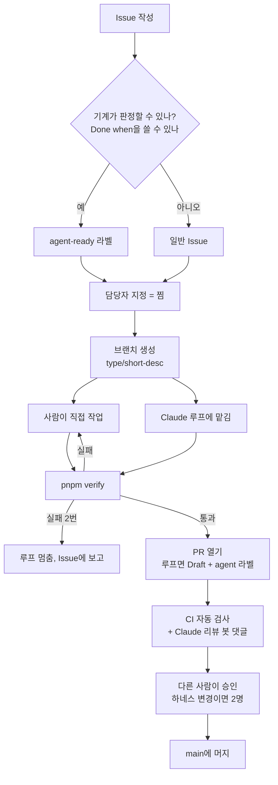

# 이 저장소는 어떻게 돌아가나

> 처음 합류한 사람을 위한 안내서예요. "하네스", "루프" 같은 말을 몰라도 읽을 수 있게 썼어요.
> 영어판: [GUIDE.en.md](./GUIDE.en.md) · 규칙 원문: [CONTRIBUTING.md](../CONTRIBUTING.md),
> [HARNESS.md](./HARNESS.md)

## 0. 세 줄 요약

1. **모든 일은 GitHub Issue에서 시작해서 Pull Request(PR)로 끝나요.** Issue에 자기 이름을
   걸고(담당자 지정), 브랜치에서 작업하고, PR로 합쳐요.
2. **코드는 사람이 쓸 수도 있고 AI(Claude)에게 맡길 수도 있어요.** 어느 쪽이든 같은 검사를
   통과해야 하고, 마지막 승인은 항상 다른 사람이 해요.
3. **검사는 네 겹이에요.** 내 컴퓨터의 Claude 설정 → `pnpm verify` → GitHub CI → 사람 리뷰.
   앞의 세 겹은 자동이고, 마지막 한 겹만 사람이에요.

---

## 1. 용어 다섯 개만 알면 돼요

| 용어 | 쉬운 말 | 이 저장소에서는 |
|---|---|---|
| **하네스 (harness)** | AI가 일할 때 지키는 규칙과 안전장치 전체. 말에 채우는 마구처럼, 힘은 AI가 쓰고 방향은 하네스가 잡아요. | `CLAUDE.md`, `.claude/` 폴더, 검사 명령, CI. 아래 [파일 지도](#5-파일-지도)에 다 있어요. |
| **루프 (loop)** | AI에게 "끝날 때까지 고치고 검사하기를 반복해"라고 맡기는 것. 사람이 매 단계 지켜보지 않아요. | Claude Code의 `/loop` 명령. `agent-ready` 라벨이 붙은 Issue에만 써요. |
| **판정 기준 (oracle)** | "다 됐다"를 사람 눈이 아니라 기계가 판단할 수 있는 기준. | Issue의 **Done when** 칸. 예: "`e2e/thread.spec.ts`가 통과한다". |
| **훅 (hook)** | Claude가 명령을 실행하기 직전에 자동으로 끼어드는 검문소. | `.claude/hooks/`. main에 직접 커밋하기, 배포, force-push, 비밀키 출력을 막아요. |
| **CI** | PR을 올리면 GitHub가 자동으로 돌리는 검사. 실패하면 빨간불이 켜져요. | `.github/workflows/`. 타입, 테스트, 린트, 포맷, 번들 크기, 훅 테스트를 검사해요. |

**왜 이렇게까지 하나요?** 이 프로젝트에서 실제로 있었던 일 때문이에요. 모든 자동 검사를
통과했는데 첫 화면 로딩이 0.6초에서 5.6초로 느려진 변경이 있었어요. 사람이 지켜보지
않았다면 그대로 배포됐을 거예요. 그래서 원칙을 하나 세웠어요. **AI에게는 "다 됐다"를
기계가 판정할 수 있는 일만 맡기고, 판정이 사람 몫인 일은 사람이 해요.**

---

## 2. 일 하나가 흘러가는 길

단계마다 하는 일은 이래요.

| 단계 | 하는 일 | 왜 |
|---|---|---|
| Issue 작성 | 무엇을 왜 바꾸는지 적어요. AI에게 맡길 일이면 *Agent task* 템플릿을 쓰고 **Done when**을 꼭 채워요. | Done when을 못 쓰면 AI가 언제 멈춰야 할지 모르고, 검사가 통과할 때까지 엉뚱한 걸 계속 고쳐요. |
| 담당자 지정 | Issue에 자기를 assignee로 걸어요. | 두 사람(또는 두 루프)이 같은 일을 동시에 하지 않게 하는 "찜" 표시예요. |
| 브랜치 | `main`에서 `feat/…`, `fix/…`, `docs/…` 이름으로 따요. Issue 하나에 브랜치 하나예요. | `main`은 모두가 공유하는 원본이라 직접 건드리지 않아요. |
| 작업 | 사람이 하거나 Claude에게 맡겨요. 루프는 두 번 실패하면 멈추고 Issue에 이유를 남겨요. | 무한히 재시도하는 AI는 결국 "검사만 통과하는 엉뚱한 코드"를 만들어요. |
| `pnpm verify` | 내 컴퓨터에서 검사 7가지를 한 번에 돌려요(아래 3장). | 지금은 브라우저 테스트(E2E)가 **내 컴퓨터에서만** 돌아요. CI에는 아직 없어요. |
| PR | Issue를 닫는 PR을 열고 템플릿 체크박스를 채워요. 루프가 만든 PR은 Draft로 열어서, 돌린 사람이 먼저 읽고 Ready로 바꿔요. | 리뷰어가 무엇이 어떻게 검증됐는지 바로 알 수 있어요. |
| CI + 리뷰 봇 | GitHub가 자동으로 검사하고, Claude 봇이 PR에 리뷰 댓글을 달아요. | 사람 리뷰어가 기계적인 실수를 볼 필요가 없게 해요. |
| 승인 | **작성자나 루프를 돌린 사람이 아닌 다른 사람이** 승인해요. 하네스 파일을 바꾸는 PR은 2명이 승인해요. | 루프를 돌린 사람은 이미 결과가 괜찮다고 판단한 사람이라, 그 판단을 다시 확인할 사람이 필요해요. |

---

## 3. 검사 네 겹: 각각 무엇을 잡고 무엇을 놓치나

| 겹 | 어디서 | 잡는 것 | 놓치는 것 |
|---|---|---|---|
| ① Claude 설정 | 내 컴퓨터, Claude가 명령을 실행하기 **직전** | main 직접 커밋, 배포, force-push, `.env` 비밀키 읽기 | 사람이 직접 친 명령. Claude 설정이 없는 컴퓨터 |
| ② `pnpm verify` | 내 컴퓨터, PR 올리기 전 | 타입 오류 → 린트 → 포맷 → 단위 테스트 → 빌드 → 번들 크기 → **E2E(실제 브라우저로 기능 확인)** | 돌리는 걸 잊는 것. 성능 저하 같은 판단의 문제 |
| ③ CI | GitHub, PR마다 자동 | ②에서 E2E만 빠진 전부, 그리고 훅 테스트 | **기능이 실제로 동작하는지.** E2E가 아직 CI에 없어요 |
| ④ 사람 리뷰 | GitHub PR | 방향이 맞는지, 문구와 톤, 성능 판단, "이걸 해야 하나" | 피곤함. 그래서 ①~③이 먼저 걸러 줘요 |

중요한 점은 ②만 "기능이 진짜 동작하는지"를 확인한다는 거예요. 그래서 CI가 초록불이어도
PR 작성자는 `pnpm verify`를 돌렸다고 PR에 체크해야 해요. CI에서 E2E를 돌리는 작업이 끝나면
이 규칙은 없어져요.

---

## 4. 사람만 하는 일

AI에게 절대 맡기지 않는 일이에요. 훅과 설정이 일부를 기계적으로 막아 두었고, 나머지는
리뷰에서 지켜요.

- 운영 DB 쓰기, 배포, 돈이 드는 모든 것
- 성능 숫자를 보고 "이건 안 고친다"를 정하는 것
- 화면 문구와 톤
- DB 마이그레이션 번호 매기기와 적용
- 하네스 자체를 바꾸는 것(`CLAUDE.md`, `.claude/`, `docs/HARNESS.md` 등)
- AI가 만든 PR 승인

---

## 5. 파일 지도

**누가 읽나** 칸의 뜻: 👤 사람, 🤖 Claude(로컬에서 자동으로 읽음), ⚙️ GitHub(자동 실행).

### 규칙과 안내 문서

| 파일 | 역할 | 누가 읽나 | 언제 고치나 |
|---|---|---|---|
| `docs/GUIDE.md` | 이 문서. 전체 그림 | 👤 | 시스템 구조가 바뀔 때 |
| `CONTRIBUTING.md` | 사람용 작업 규칙: 셋업, Issue→PR 순서, 승인 규칙, 관리자용 GitHub 설정 명령 | 👤 | 팀 작업 방식이 바뀔 때 (승인 2명) |
| `CLAUDE.md` | **Claude가 매 세션 시작할 때 자동으로 읽는** 프로젝트 설명서. 기술 스택, 명령어, 함정, 코드 규칙 | 🤖 👤 | 모든 팀원의 Claude 동작이 바뀌니까 PR로만 (승인 2명) |
| `CLAUDE.local.md` | 나만의 Claude 지시. git에 올라가지 않아요 | 🤖 | 마음대로 |
| `docs/HARNESS.md` | 루프 규칙의 원문과 **그 이유**. 무엇을 맡기고 무엇을 안 맡기는지, 겪은 함정 기록 | 👤 🤖 | 함정을 새로 겪었을 때 (승인 2명) |
| `docs/TODAY_PLAN.md` | 예전 작업 목록. 지금은 기록용이고 새 일은 Issue로 해요 | 👤 | 고치지 않음 |
| `docs/PRODUCT_DIRECTION.md` | 제품 방향. README와 다르면 이 문서가 맞아요 | 👤 🤖 | 방향이 바뀔 때 |
| `docs/PERFORMANCE.md`, `STREAMING_PERF.md` | 성능 측정 방법과 결과 | 👤 | 성능 작업 후 |
| `docs/migrations/` | DB 구조 변경 SQL. 번호 순서대로 적용해요 | 👤 | 마이그레이션 담당자가 |
| `docs/claude-usage/` | Claude 활용 방식을 정리한 초기 노트 | 👤 | 참고용 |

### Claude 설정 (`.claude/`)

| 파일 | 역할 | 누가 읽나 |
|---|---|---|
| `.claude/settings.json` | 팀 공통 Claude 설정. ① 금지 목록(`permissions.deny`): `.env` 읽기, 배포. ② 어떤 훅을 언제 실행할지 | 🤖 |
| `.claude/settings.local.json` | 내 개인 설정(자주 쓰는 명령 허용 등). git에 올라가지 않아요 | 🤖 |
| `.claude/hooks/block-main-commit.sh` | Claude가 `main` 브랜치에 커밋하려 하면 막아요 | 🤖 |
| `.claude/hooks/block-risky-commands.sh` | 배포, force-push, `.env` 출력을 막아요. 막히면 `Blocked: …` 메시지가 떠요 | 🤖 |
| `.claude/hooks/*.test.sh` | 위 훅들의 테스트. 막아야 할 것과 통과시켜야 할 것을 둘 다 확인해요. CI에서 자동 실행돼요 | ⚙️ |

### GitHub 설정 (`.github/`)

| 파일 | 역할 | 언제 동작하나 |
|---|---|---|
| `workflows/ci.yml` | 타입, 단위 테스트, 린트, 포맷, 훅 테스트 | PR마다, main 푸시마다 |
| `workflows/bundle-budget.yml` | 사용자에게 내려가는 JS가 250KB(gzip)를 넘으면 실패 | PR마다 |
| `workflows/claude-code-review.yml` | Claude 봇이 PR을 읽고 리뷰 댓글을 달아요. 비용 때문에 PR당 1번만 돌아요 | PR 열릴 때 (`@claude review` 댓글로 다시 요청 가능) |
| `workflows/claude.yml` | Issue나 PR 댓글에 `@claude`라고 쓰면 Claude가 답해요 | `@claude` 언급 시 |
| `ISSUE_TEMPLATE/agent-task.yml` | AI에게 맡길 Issue 양식. **Done when**이 필수이고 `agent-ready` 라벨이 자동으로 붙어요 | Issue 만들 때 |
| `pull_request_template.md` | PR 본문 양식. 검증 여부, 루프 여부, 하네스 변경 여부 체크박스 | PR 만들 때 |
| `CODEOWNERS` | 특정 파일이 바뀌면 자동으로 지정되는 리뷰어 | PR 만들 때 |

### 검사와 테스트

| 파일 | 역할 |
|---|---|
| `package.json`의 `verify` 스크립트 | 검사 7가지를 순서대로 한 번에 돌리는 명령. 따로따로 두면 사람도 AI도 일부만 돌려서 하나로 묶었어요 |
| `e2e/`, `playwright.config.ts` | 실제 브라우저로 로그인, 일기 쓰기, 삭제, 탈퇴를 확인하는 테스트. 테스트 전용 계정 `e2e-test-user`로 돌아요 |
| `src/**/*.test.ts`, `scripts/__tests__/` | 단위 테스트(Vitest) |
| `scripts/check-bundle-budget.mjs` | 번들 크기 검사 |
| `scripts/seed.mjs` | 개발 DB에 샘플 일기를 넣어요 |

### 기타

| 파일 | 역할 |
|---|---|
| `.env.example` | 필요한 환경 변수 목록. 복사해서 `.env.local`을 만들어요. 값은 **개발용** DB 것을 넣어요 |
| `.gitignore` | git에 올라가지 않는 파일 목록. `.env*`, 개인 Claude 설정 포함 |
| `README.md` | 초기 설계 문서. 제품 방향은 `docs/PRODUCT_DIRECTION.md`가 우선이에요 |

---

## 6. 이럴 땐 이렇게

| 상황 | 할 일 |
|---|---|
| 새 기능을 만들고 싶어요 | Issue 작성 → 자기를 담당자로 지정 → 브랜치 → 작업 → `pnpm verify` → PR |
| Claude에게 통째로 맡기고 싶어요 | Issue에 Done when을 쓸 수 있는지 먼저 봐요. 쓸 수 있으면 *Agent task* 템플릿으로 만들고, `docs/HARNESS.md`의 *Running a loop*에 있는 프롬프트를 써요. 못 쓰면 일을 더 잘게 쪼개거나 직접 해요 |
| Claude가 `Blocked: …`라며 멈췄어요 | 훅이 막은 거예요. 메시지가 이유를 알려 줘요. 정말 필요한 일이면 사람이 직접 해요. 설명 텍스트에 명령어가 들어가서 막힌 거라면 텍스트를 파일로 넘겨요(예: `git commit -F 파일`) |
| CI가 빨간불이에요 | PR의 Checks 탭에서 실패한 단계를 봐요. 단계가 나뉘어 있어서 무엇이 실패했는지 바로 보여요. 포맷 실패면 `pnpm format`으로 고쳐요 |
| 화면이 다 404예요 / DB가 안 돼요 | 공유 개발 DB가 죽었을 수 있어요(실제로 있었던 일이에요). DB 담당자에게 알리고, 급하면 `supabase start`로 로컬 DB를 써요 |
| 규칙이 이상해요 / 같은 함정에 또 빠졌어요 | 처음이면 `CLAUDE.md`의 Gotchas나 `docs/HARNESS.md`에 기록하는 PR을 올려요. 두 번째면 문서 대신 훅, 테스트, 린트 규칙 같은 장치로 만들어요 |

---

## 7. 아직 안 된 것 (2026-10-10 기준)

규칙에는 적혀 있지만 실제로는 아직인 것들이에요. 끝나면 이 목록에서 지워 주세요.

- [ ] CI에서 E2E 돌리기. 개발용 Supabase 프로젝트와 GitHub Secrets가 필요해요
- [ ] E2E 테스트 계정을 실행마다 분리하기. 지금은 두 사람이 동시에 돌리면 서로 데이터를 지워요
- [ ] `main` branch protection 적용, `agent-ready`/`agent` 라벨 만들기(명령은 `CONTRIBUTING.md` 맨 아래)
- [ ] 사람별 하루 루프 예산 금액 정하기
- [ ] `CODEOWNERS`에 팀원 추가
- [ ] 로컬 Supabase 설정(`supabase/`) 커밋
